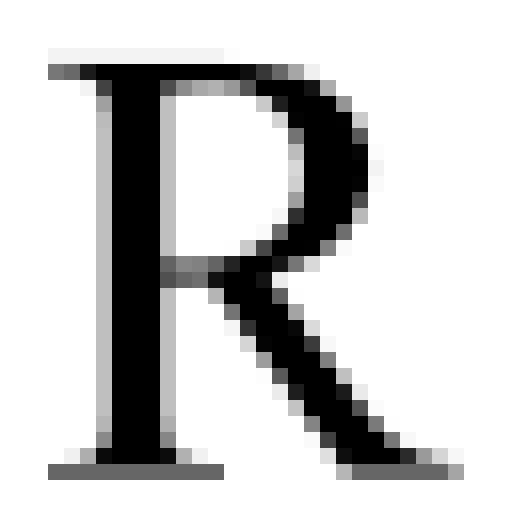
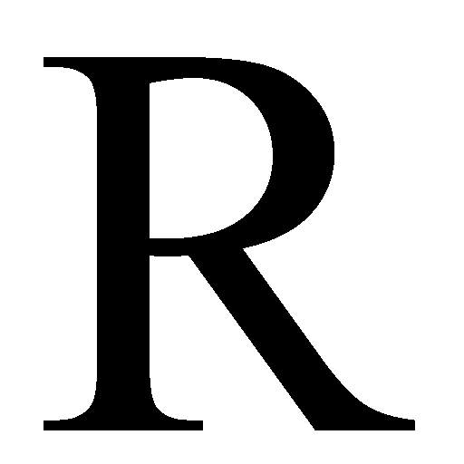

# Task01: Rasterization of parametric curves

**Deadline: April 25st (Thu) at 15:00pm**


This is the blurred preview of the expected result:



When you execute the program, it will output an PNG image file (`output.png`) replacing the image below. Try making the image below and the image above look similar after doing the assignment.



----

## Instruction

Please follow this instruction to prepare the environment to do the assignment 

If you did not do the [task01](../task01) assignment, you need to prepare **git**, **cmake**, and **C++ compiler** in your computer to complete this assignment. 
Read the following document to install these.

[How to Set Up C++ Programming Environment](../doc/setup_env.md)

If you had some trouble with `git` in the local repository in the previous assignment, `clone` your remote repository again to avoid trouble.

```bash
$ git clone https://github.com/ACG-2024S/acg-<username>.git
```


Go to the top of the local repository

```bash
$ cd acg-<username>     # go to the local repository
```

### Update Local Repository

Update the local repository on your computer

```bash
$ git checkout main   # set main branch as the current branch
$ git fetch origin main    # download the main branch from remote repository
$ git reset --hard origin/main  # reset the local main branch same as remote repository
```

After this command, you will see the local repository is synced with the remote repository at `https://github.com/ACG-2024S/acg-<username>`

### Create a Branch

To do this assignment, you need to be in the branch `task02`.  
You can always check your the current branch by

```bash
$ git branch -a   # list all branches, showing the current branch 
```

You are probably in the `main` branch. Let's create the `task02` branch and set it as the current branch.

```bash
$ git branch task02   # create task0 branch
$ git checkout task02  # switch into the task02 branch
$ git branch -a   # make sure you are in the task02 branch
```

The environment is ready. 

## Problem1

Install eigen under `acg-<username>/external` by the following command

```bash
$ pwd # make sure you are in acg-<username> directory 
$ git submodule update --init external/eigen # clone the "eigen" repository (this may take one or two minutes)
```

Make sure you have a header file `Dense` at
```
acg-<username>/external/eigen/Eigen/Dense
```

Eigen can be used as a header-only library. You do not need to compile it to do this task.

Next, compile the code with **out-of-source** build by making a new directory for build `task02/build` and compile inside that directory
```bash
$ cd task02  # you are in "acg-<username>/task02" directory
$ mkdir build
$ cd build
$ cmake -DCMAKE_BUILD_TYPE=Release .. # configure Release mode for fast execution
$ cmake --build .
```

Now you will see the `output.png` is updated. The `output.png` will show an angular shape of the letter **R**. Now let's write a program to make the font shape smooth as the original one.


## Problem2

The code you compiled above uses the ***Jordan's curve theorem** to find whether the center of a pixel is inside or outside the character.The code counts the number of intersections of a ray against the boundary.
The boundary of the letter is represented by sequences of line segments and quadratic Bézier curves. The Problem1's output was angular because the Bézier curve was approximated as a line segment.

Modify the code `main.cpp` around line #65 to compute the number of intersections of a ray against the Bézier curve. The output will be the letter ***R*** with smooth boundary.


### Submit

Finally, you submit the document by pushing to the `task02` branch of the remote repository. 

```bash
cd acg-<username>    # go to the top of the repository
git status  # check the changes
git add .   # stage the changes
git status  # check the staged changes
git commit -m "task02 finished"   # the comment can be anything
git push --set-upstream origin task02  # update the task02 branch of the remote repository
```

got to the GitHub webpage `https://github.com/ACG-2024S/acg-<username>`. 
If everything looks good on this page, make a pull request. 


----

## Trouble Shooting

If you have trouble with `#include <filesystem>`, your C++ compilar is very old. Try update one. Following command may work tos specify which compilar to use on linux & Mac

```
export CC=/usr/local/bin/gcc-8
export CXX=/usr/local/bin/g++-8
cmake ..
```


----

## Reference

- Coding Adventure: Rendering Text
  : https://www.youtube.com/watch?v=SO83KQuuZvg

- SIGGRAPH 2022 Talk - A Fast & Robust Solution for Cubic & Higher-Order Polynomials by Cem Yuksel: https://www.youtube.com/watch?v=ok0EZ0fBCMA

- True Type: https://en.wikipedia.org/wiki/TrueType
